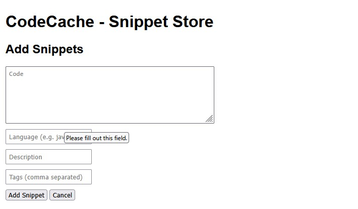
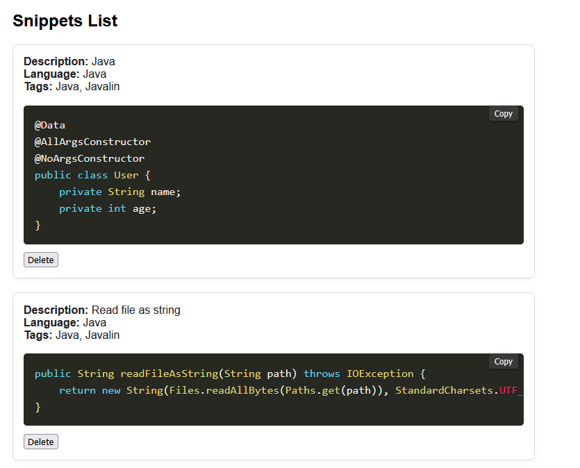
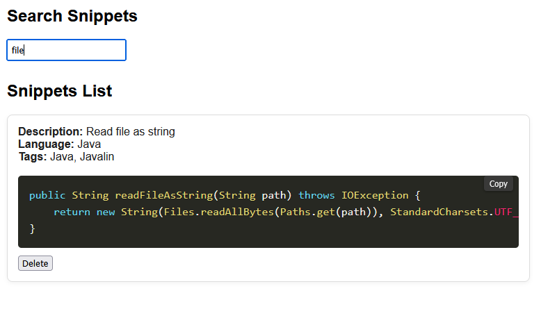
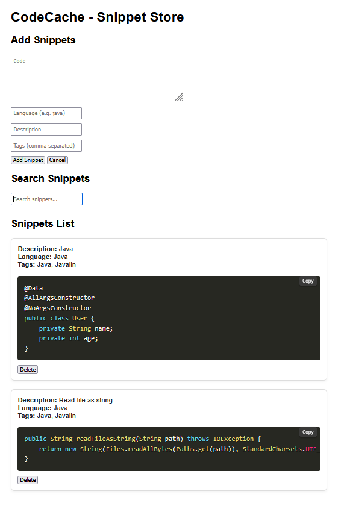

# CodeCache 📦


A lightweight, fast code snippet manager built to solve a real problem: spending too much time searching for code I'd written before.

**Live Demo:** [https://code-cache-gs8b.onrender.com/](https://code-cache-gs8b.onrender.com/)  
*Note: Hosted on Render free tier - first load after inactivity may take 30-60 seconds*

---

## Why I Built This

As a developer, I found myself constantly re-searching for the same code snippets across old projects, Stack Overflow history, and random text files. CodeCache solves this by giving me a simple, searchable library of reusable code.

---

## Features

- ✨ **Fast snippet creation** - Save code with description, language, and tags
- 🔍 **Real-time search** - Instantly filter snippets as you type
- 🎨 **Syntax highlighting** - Beautiful code display with Prism.js
- 📋 **One-click copy** - Copy any snippet to clipboard instantly
- 🏷️ **Tag organization** - Categorize snippets with multiple tags
- 🗑️ **Easy management** - Delete snippets with one click

---

## Tech Stack

**Backend:**
- Javalin 6.7.0 (lightweight Java web framework)
- Java 21
- In-memory storage (List-based)

**Frontend:**
- HTMX (dynamic UI without heavy JavaScript frameworks)
- Prism.js (syntax highlighting)
- Vanilla JavaScript
- Custom CSS

**DevOps:**
- Docker (multi-stage build for optimized images)
- Render (cloud deployment)
- Maven (dependency management)

---

## Screenshots

### Add Snippet


### Snippet List with Syntax Highlighting


### Real-time Search


### Complete App Screen


---

## Getting Started

### Prerequisites
- Java 21 or higher
- Maven 3.9+

### Local Development

1. **Clone the repository**
   ```bash
   git clone https://github.com/yourusername/code-cache.git
   cd code-cache
   ```

2. **Build and run**
   ```bash
   mvn clean package
   java -jar target/code-cache-0.1.0-SNAPSHOT.jar
   ```

3. **Open your browser**
   ```
   http://localhost:7000
   ```

### Docker Development

1. **Build the image**
   ```bash
   docker build -t codecache .
   ```

2. **Run the container**
   ```bash
   docker run -p 8080:8080 -e PORT=8080 codecache
   ```

3. **Access the app**
   ```
   http://localhost:8080
   ```

---

## Project Structure

```
code-cache/
├── src/
│   └── main/
│       └── java/
│           └── com/developer/
│               ├── Main.java           # Application entry point
│               └── Snippet.java        # Data model
├── Dockerfile                          # Multi-stage Docker build
├── pom.xml                            # Maven dependencies
└── README.md
```

---

## Architecture Decisions

### Why Javalin?
- Lightweight and fast (~5MB framework)
- Simple, expressive API
- Perfect for small to medium web apps
- No magic - easy to understand what's happening

### Why HTMX?
- Modern interactivity without complex JavaScript frameworks
- Server-side rendering keeps logic in one place
- Smaller bundle size, faster page loads
- Progressive enhancement approach

### Why In-Memory Storage?
- Simplicity for MVP
- Fast read/write operations
- Easy to upgrade to persistent storage later (SQLite, PostgreSQL)

### Why Multi-Stage Docker Build?
- Separates build environment from runtime
- Reduces final image size (303MB vs 500MB+)
- Faster deployments and container starts

---

## Roadmap

Future improvements I'm considering:

- [ ] **Persistent storage** (PostgreSQL or SQLite)
- [ ] **Edit functionality** (complete CRUD operations)
- [ ] **User authentication** (private snippet libraries)
- [ ] **Filter by language** (dropdown or sidebar)
- [ ] **Dark mode toggle**
- [ ] **Export/import** (JSON backup)
- [ ] **Snippet sharing** (public URLs for sharing)
- [ ] **Mobile responsive design**

---

## What I Learned

Building CodeCache taught me:

1. **HTMX for dynamic UIs** - Server-side rendering can be modern and fast
2. **Docker optimization** - Multi-stage builds for production-ready images
3. **Deployment workflows** - From localhost to production with Docker + Render
4. **Shipping mindset** - Perfect is the enemy of done - MVP first, iterate later

---

## Contributing

This is a personal learning project, but feedback and suggestions are welcome! Feel free to:

- Open an issue for bugs or feature requests
- Submit a PR for improvements
- Fork it and make it your own

---

## License

MIT License - feel free to use this code for your own projects.

---

## Contact

**Raghav**  
[GitHub](https://github.com/kenduraghav) | [LinkedIn](https://linkedin.com/in/raghavendran-karthik)

---

## Acknowledgments

- [Javalin](https://javalin.io/) - Fantastic lightweight Java web framework
- [HTMX](https://htmx.org/) - Making server-side rendering cool again
- [Prism.js](https://prismjs.com/) - Beautiful syntax highlighting

---

*Built as part of learning, Shipped, not perfect.*